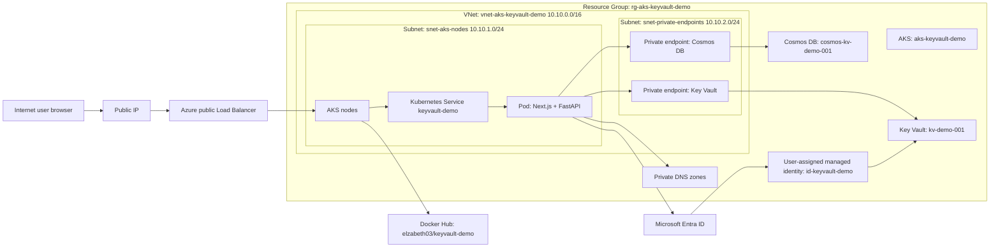

# Azure Architecture Resource Layout

This document describes the Azure architecture for the AKS Key Vault Workload Identity app. It focuses on resource placement, VNet and subnet boundaries, and the connection arrows to show in an architecture diagram.

## 1. Architecture Summary

The application is a secure notes workspace packaged as one container image:

- Next.js frontend listens on port `3000`.
- FastAPI backend listens inside the same container on `127.0.0.1:8000`.
- Azure Cosmos DB for NoSQL stores user and note documents.
- Azure Key Vault stores the Cosmos DB endpoint, Cosmos DB key, and JWT signing secret.
- Docker Hub stores the app image `elzabeth03/keyvault-demo:1.0.0`.
- AKS runs the application pod.
- Azure Workload Identity lets the pod authenticate as a user-assigned managed identity.
- Private endpoints are used for Key Vault and Cosmos DB where available.

High-level flow:

```text
User browser
  -> Public Azure Load Balancer
  -> AKS node in snet-aks-nodes
  -> Kubernetes Service keyvault-demo
  -> Pod keyvault-demo
  -> Next.js on port 3000
  -> FastAPI on localhost:8000
  -> Key Vault private endpoint for Cosmos credentials and JWT signing secret
  -> Cosmos DB private endpoint for data reads/writes
```

## 2. Resource Group Layout

Primary resource group:

```text
rg-aks-keyvault-demo
```

Resources in this resource group:

| Resource | Example name | Placement | Purpose |
| --- | --- | --- | --- |
| Virtual network | `vnet-aks-keyvault-demo` | Resource group, regional network resource | Holds AKS node subnet and private endpoint subnet |
| AKS cluster | `aks-keyvault-demo` | Resource group, attached to `snet-aks-nodes` | Runs the Kubernetes workload |
| Cosmos DB account | `cosmos-kv-demo-001` | Resource group, service outside VNet with private endpoint inside VNet | Stores users and notes in database `demoapp`, containers `users` and `notes` |
| Key Vault | `kv-demo-001` | Resource group, service outside VNet with private endpoint inside VNet | Stores `cosmos-endpoint`, `cosmos-key`, and `auth-jwt-secret` secrets |
| User-assigned managed identity | `id-keyvault-demo` | Resource group, identity resource outside VNet | Identity used by the application pod through Workload Identity |
| Private endpoint for Cosmos DB | `pe-cosmos-kvdemo` | Inside `snet-private-endpoints` | Gives Cosmos DB a private IP in the VNet |
| Private endpoint for Key Vault | `pe-kv-kvdemo` | Inside `snet-private-endpoints` | Gives Key Vault a private IP in the VNet |
| Private DNS zone | `privatelink.documents.azure.com` | Resource group, linked to VNet | Resolves Cosmos DB private endpoint names |
| Private DNS zone | `privatelink.vaultcore.azure.net` | Resource group, linked to VNet | Resolves Key Vault private endpoint names |

AKS also creates a managed node resource group, usually named like:

```text
MC_rg-aks-keyvault-demo_aks-keyvault-demo_<region>
```

Resources in the AKS managed resource group:

| Resource | Placement | Purpose |
| --- | --- | --- |
| Virtual machine scale set or node VMs | Connected to `snet-aks-nodes` | AKS worker nodes |
| Network security group | Associated with AKS node networking | Controls node subnet traffic |
| Route table or network resources | Associated with AKS networking | Supports cluster routing |
| Public Azure Load Balancer | Outside the VNet boundary, connected to AKS nodes | Created by Kubernetes `Service` type `LoadBalancer` |
| Public IP address | Outside the VNet boundary | External app endpoint, such as `http://4.224.237.4` |
| AKS kubelet identity | Azure-managed identity | Lets nodes pull public container images |

Do not manually edit resources in the AKS managed resource group unless there is a clear operational reason. AKS owns those resources.

## 3. VNet And Subnet Layout

VNet:

```text
vnet-aks-keyvault-demo
Address space: 10.10.0.0/16
```

Subnets:

| Subnet | CIDR | Contains | Notes |
| --- | --- | --- | --- |
| `snet-aks-nodes` | `10.10.1.0/24` | AKS worker nodes and application pods running on those nodes | Select this subnet during AKS creation |
| `snet-private-endpoints` | `10.10.2.0/24` | Private endpoints for Key Vault and Cosmos DB | Do not place AKS nodes here |

Kubernetes service network:

| Item | CIDR or IP | Placement |
| --- | --- | --- |
| Kubernetes service CIDR | `10.2.0.0/16` | Internal Kubernetes virtual network range, not a VNet subnet |
| Kubernetes DNS service IP | `10.2.0.10` | Internal Kubernetes service IP |

Important placement rule:

- `10.2.0.0/16` must not overlap with `10.10.0.0/16`.
- Private endpoints belong in `snet-private-endpoints`.
- AKS nodes belong in `snet-aks-nodes`.

## 4. What Is Inside The VNet

Inside `vnet-aks-keyvault-demo`:

| Area | Resource | Why it is inside |
| --- | --- | --- |
| `snet-aks-nodes` | AKS node pool VMs or VMSS instances | The app pod runs on these nodes |
| `snet-aks-nodes` | Application pod `keyvault-demo` | Scheduled onto AKS nodes |
| `snet-aks-nodes` | Kubernetes Service routing to the pod | Cluster networking forwards traffic to the pod |
| `snet-private-endpoints` | Key Vault private endpoint `pe-kv-kvdemo` | Private IP path to Key Vault |
| `snet-private-endpoints` | Cosmos DB private endpoint `pe-cosmos-kvdemo` | Private IP path to Cosmos DB |

## 5. What Is Outside The VNet

These resources are Azure platform resources that are not placed inside a subnet, even though private endpoints give them private IPs in the VNet:

| Resource | Example name | Why outside VNet |
| --- | --- | --- |
| Azure Key Vault | `kv-demo-001` | Managed platform service; private endpoint NIC is inside the VNet |
| Azure Cosmos DB | `cosmos-kv-demo-001` | Managed platform service; private endpoint NIC is inside the VNet |
| Docker Hub | `elzabeth03/keyvault-demo:1.0.0` | External public registry used by AKS to pull the app image |
| User-assigned managed identity | `id-keyvault-demo` | Microsoft Entra identity resource, not a network resource |
| Microsoft Entra ID | Tenant `Default Directory` | Identity provider outside the VNet |
| AKS OIDC issuer | AKS-managed issuer URL | Identity trust endpoint used by Entra ID |
| Public Azure Load Balancer | Created by Kubernetes `LoadBalancer` service | Internet-facing entry point for the demo app |
| Public IP address | External app IP | Receives browser traffic from the internet |

## 6. Kubernetes Resources Inside AKS

Namespace:

```text
keyvault-demo
```

Kubernetes resources:

| Kubernetes resource | File | Purpose |
| --- | --- | --- |
| Namespace | `k8s/namespace.yaml` | Isolates the demo app resources |
| ServiceAccount | `k8s/service-account.yaml` | Connects the pod to the user-assigned managed identity |
| Deployment | `k8s/deployment.yaml` | Runs two replicas of the app container |
| Service | `k8s/service.yaml` | Exposes the app on port `80` through an Azure Load Balancer |
| Kustomization | `k8s/kustomization.yaml` | Applies all Kubernetes manifests together |

Important labels and annotations:

```yaml
azure.workload.identity/use: "true"
azure.workload.identity/client-id: "<id-keyvault-demo client id>"
```

The ServiceAccount annotation uses the managed identity client ID. The Key Vault RBAC role assignment uses the managed identity object or principal ID.

## 7. Connection Arrows For The Architecture Diagram

Use these arrows for the user request path:

```text
Internet user browser
  -> Public IP address
  -> Azure public Load Balancer
  -> AKS node in snet-aks-nodes
  -> Kubernetes Service keyvault-demo, port 80
  -> Pod keyvault-demo, container port 3000
  -> Next.js frontend
  -> FastAPI backend on 127.0.0.1:8000
```

Use these arrows for Key Vault secret access:

```text
FastAPI backend
  -> DefaultAzureCredential
  -> projected Kubernetes service account token
  -> AKS OIDC issuer
  -> Microsoft Entra ID
  -> user-assigned managed identity id-keyvault-demo
  -> Key Vault RBAC check
  -> Key Vault private endpoint in snet-private-endpoints
  -> Key Vault secrets cosmos-endpoint, cosmos-key, and auth-jwt-secret
```

Use these arrows for Cosmos DB data access:

```text
FastAPI backend
  -> reads Cosmos endpoint, key, and JWT signing secret from Key Vault
  -> validates bearer token or signs a new token
  -> private DNS resolves Cosmos hostname to private endpoint IP
  -> Cosmos DB private endpoint in snet-private-endpoints
  -> Cosmos DB account cosmos-kv-demo-001
  -> database demoapp
  -> containers users and notes
```

Use these arrows for container image pull:

```text
AKS scheduler places pod on node
  -> kubelet on AKS node
  -> Docker Hub
  -> image elzabeth03/keyvault-demo:1.0.0
```

Use these arrows for image build and push:

```text
Developer machine or build agent
  -> Docker build
  -> Docker Hub login
  -> Docker Hub repository elzabeth03/keyvault-demo
```

## 8. IAM And Identity Placement

Identity resources are not inside subnets, but they are essential to the architecture.

| Identity | Location | Role assignment | Scope | Used for |
| --- | --- | --- | --- | --- |
| Signed-in Azure user | Microsoft Entra ID | `Contributor` and `User Access Administrator`, or equivalent | Subscription or `rg-aks-keyvault-demo` | Creates resources and assigns roles |
| User-assigned managed identity | `id-keyvault-demo` in the app resource group | `Key Vault Secrets User` | Key Vault `kv-demo-001` | Pod reads Key Vault secrets |
| AKS control plane identity | AKS managed identity | Azure-managed permissions | AKS infrastructure resources | Cluster operations |

The `Key Vault Secrets User` role must be assigned to `id-keyvault-demo`, not to the AKS agent pool identity.

## 9. Private DNS Placement

Private DNS zones are not subnets, but they must be linked to `vnet-aks-keyvault-demo`.

| Private DNS zone | Linked VNet | Resolves |
| --- | --- | --- |
| `privatelink.vaultcore.azure.net` | `vnet-aks-keyvault-demo` | Key Vault private endpoint |
| `privatelink.documents.azure.com` | `vnet-aks-keyvault-demo` | Cosmos DB private endpoint |

Diagram note:

```text
AKS node subnet
  -> Private DNS zone linked to VNet
  -> private endpoint IP in snet-private-endpoints
```

## 10. Public And Private Exposure

Public by design for this demo:

| Resource | Public exposure | Why |
| --- | --- | --- |
| Kubernetes Service `keyvault-demo` | Public LoadBalancer IP | Lets a browser open the demo app |

Private or restricted:

| Resource | Recommended exposure | Why |
| --- | --- | --- |
| Key Vault | Private endpoint, public access disabled | Secrets should not be reachable from all networks |
| Cosmos DB | Private endpoint, public access disabled | Database should not be reachable from all networks |
| Docker Hub image | Public repository, or private repository with Kubernetes image pull secret | AKS must be able to pull the app image |
| AKS API server | Authorized IP ranges or private access where policy requires | Limits cluster administration access |

If the application must not be public, replace the public LoadBalancer with one of these:

- Internal LoadBalancer.
- Ingress behind an approved private or enterprise ingress path.
- `ClusterIP` plus port-forwarding for local testing.

## 11. Diagram Boundary Recommendation

Draw the architecture with these boundaries:

1. Outer boundary: Azure subscription.
2. Inside it: resource group `rg-aks-keyvault-demo`.
3. Inside the resource group: VNet `vnet-aks-keyvault-demo`.
4. Inside the VNet: two subnets, `snet-aks-nodes` and `snet-private-endpoints`.
5. Outside the VNet but inside the resource group: Key Vault, Cosmos DB, managed identity, private DNS zones.
6. Separate side box: AKS managed resource group with nodes, public Load Balancer, public IP, and kubelet identity.
7. Outside Azure networking: Internet user browser, Microsoft Entra ID, and Docker Hub.

Recommended diagram text:

```text
Azure Subscription
└─ Resource Group: rg-aks-keyvault-demo
   ├─ VNet: vnet-aks-keyvault-demo (10.10.0.0/16)
   │  ├─ Subnet: snet-aks-nodes (10.10.1.0/24)
   │  │  └─ AKS nodes -> app pods
   │  └─ Subnet: snet-private-endpoints (10.10.2.0/24)
   │     ├─ pe-kv-kvdemo
   │     ├─ pe-cosmos-kvdemo
   ├─ AKS: aks-keyvault-demo
   ├─ Key Vault: kv-demo-001
   ├─ Cosmos DB: cosmos-kv-demo-001
   ├─ Managed Identity: id-keyvault-demo
   └─ Private DNS zones linked to VNet

AKS managed resource group
└─ Public Load Balancer + public IP + node infrastructure
```

## 12. Mermaid Diagram



## 13. Checklist For Final Architecture Review

- `aks-keyvault-demo` uses `snet-aks-nodes`.
- Key Vault private endpoint uses `snet-private-endpoints`.
- Cosmos DB private endpoint uses `snet-private-endpoints`.
- Private DNS zones are linked to `vnet-aks-keyvault-demo`.
- `id-keyvault-demo` has `Key Vault Secrets User` on `kv-demo-001`.
- Key Vault contains `cosmos-endpoint`, `cosmos-key`, and `auth-jwt-secret`.
- Cosmos DB database `demoapp` contains `notes` with `/owner` and `users` with `/email`.
- Deployment image is `elzabeth03/keyvault-demo:1.0.0`.
- Kubernetes ServiceAccount has the `id-keyvault-demo` client ID annotation.
- Deployment pod template has `azure.workload.identity/use: "true"`.
- Public LoadBalancer exists only for demo app access.
- Key Vault and Cosmos DB public access are disabled after private endpoint setup.
